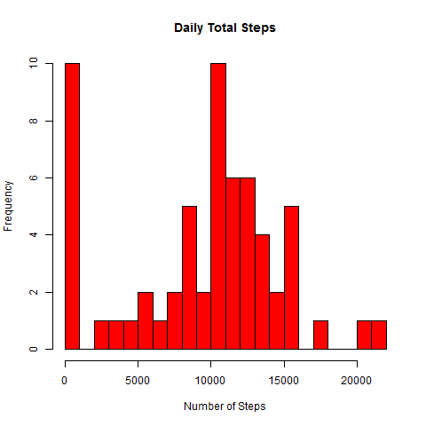
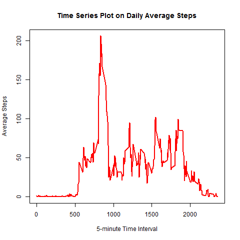
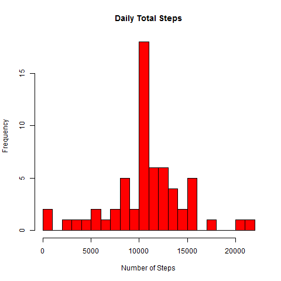
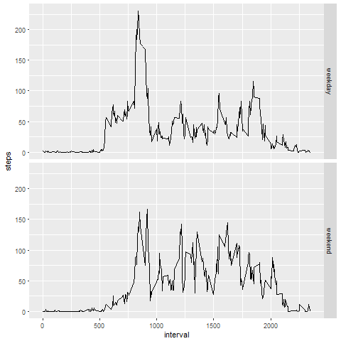

```{r setup, include=FALSE}
rm(list=ls())
library(knitr)
library(dplyr)
library(ggplot2)
library(mice)
library(sqldf)
activity<-read.csv("activity.csv")
knitr::opts_chunk$set(echo = TRUE)
```

## Calculate the total number of steps taken per day
```{r activity}
totsteps <- activity %>%
                group_by(date) %>%
                    summarize(Total = sum(steps, na.rm = TRUE))


```


# Histogram of the total number of steps taken each day
```{r totsteps, echo=TRUE}
hist(totsteps$Total, main = "Daily Total Steps", xlab = "Number of Steps", ylab = "Frequency", breaks=20, col = "red")
```
 

-<!-- --> 

```{r}
meansteps <- mean(totsteps$Total,na.rm=TRUE)

mediansteps<- median(totsteps$Total,na.rm=TRUE)
```

Mean of the total number of steps taken per day is ```r meansteps```

Median of the total number of steps taken per day is ```r mediansteps```

## Time series plot on daily average steps 
```{r}
avgsteps<- sqldf("select interval, avg(steps) as msteps from activity group by interval", drv = 'SQLite')
maxinterval<- sqldf("select interval,msteps from avgsteps avg1 inner join (select max(msteps) as maxsteps from avgsteps) avg2 on avg1.msteps=avg2.maxsteps", drv = 'SQLite')
plot(x = avgsteps$interval, y = avgsteps$msteps, type = "l", col = "red", lwd = 2, xlab = "5-minute Time Interval", ylab = "Average Steps", main = "Time Series Plot on Daily Average Steps")


```
-<!-- --> 

 ```r maxinterval$interval``` th 5-minute interval contains the maximum number of steps(```r maxinterval$msteps``` steps)

## Input Missing Values

```{r}
Novalue<- sum(!complete.cases(activity))
```
Total number of rows with missing values in the dataset is ```r Novalue```.

#Create a new dataset with missing values filled with average steps
```{r}

Missing<-activity[activity$steps %in% NA,]
Missing$steps<-avgsteps$msteps
NewActivity<-rbind(activity[complete.cases(activity),],Missing)
```

#Plot a histogram of the total number of steps taken each day 

```{r NewActivity}
newsteps <- NewActivity %>%
                group_by(date) %>%
                    summarize(Total = sum(steps,na.rm=TRUE))
hist(newsteps$Total, main = "Daily Total Steps", xlab = "Number of Steps", ylab = "Frequency",breaks=20,  col = "red")
```
-<!-- --> 

#Find mean and median of the steps in the new dataset
```{r}
meansteps<-mean(newsteps$Total,na.rm=TRUE)
mediansteps<-median(newsteps$Total,na.rm=TRUE)


```
Mean of the total number of steps taken per day is ```r meansteps```

Median of the total number of steps taken per day is ```r mediansteps```

Mean and the median is  different from that of original data.

#Differences in activity patterns between weekdays and weekends
```{r}
NewActivity$date<-as.Date(NewActivity$date,"%Y-%m-%d")
NewActivity$week<-ifelse(weekdays(NewActivity$date) %in% c("Saturday","Sunday"), "weekend", "weekday")
NewActivity$week<-as.factor(NewActivity$week)

```

#Plot differences in activity patterns between weekdays and weekends

```{r}

newsteps <- NewActivity %>% 
          group_by(week,interval) %>% 
          summarize(steps=mean(steps))

g <- ggplot(newsteps,aes(interval,steps,group=week)) + geom_line() + facet_grid(week~.)
print(g)
```
-<!-- --> 

END
