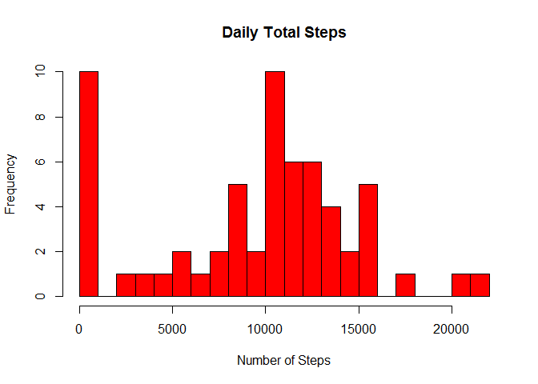
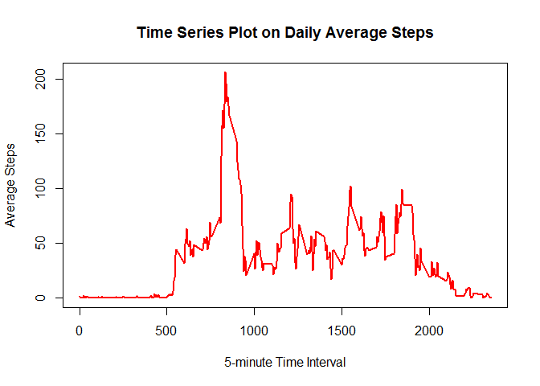
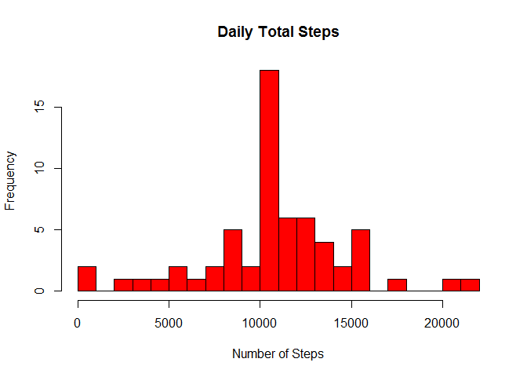

Calculate the total number of steps taken per day
-------------------------------------------------

    totsteps <- activity %>%
                    group_by(date) %>%
                        summarize(Total = sum(steps, na.rm = TRUE))

Histogram of the total number of steps taken each day
=====================================================

    hist(totsteps$Total, main = "Daily Total Steps", xlab = "Number of Steps", ylab = "Frequency", breaks=20, col = "red")

    meansteps <- mean(totsteps$Total,na.rm=TRUE)
    mediansteps<- median(totsteps$Total,na.rm=TRUE)

Mean of the total number of steps taken per day is `9354.2295082`

Median of the total number of steps taken per day is `10395`

Time series plot on daily average steps
---------------------------------------

    avgsteps<- sqldf("select interval, avg(steps) as msteps from activity group by interval", drv = 'SQLite')

    ## Loading required package: tcltk

    maxinterval<- sqldf("select interval,msteps from avgsteps avg1 inner join (select max(msteps) as maxsteps from avgsteps) avg2 on avg1.msteps=avg2.maxsteps", drv = 'SQLite')
    plot(x = avgsteps$interval, y = avgsteps$msteps, type = "l", col = "red", lwd = 2, xlab = "5-minute Time Interval", ylab = "Average Steps", main = "Time Series Plot on Daily Average Steps")

`835` th 5-minute interval contains the maximum number of
steps(`206.1698113` steps)

Input Missing Values
--------------------

    Novalue<- sum(!complete.cases(activity))

Total number of rows with missing values in the dataset is `2304`.

Create a new dataset with missing values filled with average steps
==================================================================

    Missing<-activity[activity$steps %in% NA,]
    Missing$steps<-avgsteps$msteps
    NewActivity<-rbind(activity[complete.cases(activity),],Missing)

Plot a histogram of the total number of steps taken each day
============================================================

    newsteps <- NewActivity %>%
                    group_by(date) %>%
                        summarize(Total = sum(steps,na.rm=TRUE))
    hist(newsteps$Total, main = "Daily Total Steps", xlab = "Number of Steps", ylab = "Frequency",breaks=20,  col = "red")

Find mean and median of the steps in the new dataset
====================================================

    meansteps<-mean(newsteps$Total,na.rm=TRUE)
    mediansteps<-median(newsteps$Total,na.rm=TRUE)

Mean of the total number of steps taken per day is
`1.0766189\times 10^{4}`

Median of the total number of steps taken per day is
`1.0766189\times 10^{4}`

Mean and the median is different from that of original data.

Differences in activity patterns between weekdays and weekends
==============================================================

    NewActivity$date<-as.Date(NewActivity$date,"%Y-%m-%d")
    NewActivity$week<-ifelse(weekdays(NewActivity$date) %in% c("Saturday","Sunday"), "weekend", "weekday")
    NewActivity$week<-as.factor(NewActivity$week)

Plot differences in activity patterns between weekdays and weekends
===================================================================

    newsteps <- NewActivity %>% 
              group_by(week,interval) %>% 
              summarize(steps=mean(steps))

    g <- ggplot(newsteps,aes(interval,steps,group=week)) + geom_line() + facet_grid(week~.)
    print(g)

